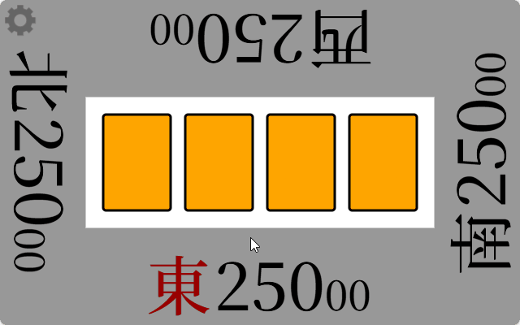

# riichi-mahjong

> [!NOTE]
> **It is a score counter created for use when playing riichi mahjong on tables without score displays.**

## Page Link

### [he1fire.github.io/riichi-mahjong](https://he1fire.github.io/riichi-mahjong)

## How To Use

> [!TIP]
> **Double-clicking on an empty space on the page will switch it to full screen mode.**

|Seat Selection|
|:---:|
||
|When you access the page, the East, South, West, and North tiles appear for taking your seat.|

|Dice|
|:---:|
||
|Clicking on the current round automatically rolls the dice. The sum of the dice is shown with arrows on all four sides, indicating who will break the wall.|

|Riichi Declaration|
|:---:|
||
|When declaring Riichi, press your score section to pay the Riichi stick.|

|Score Difference Display|
|:---:|
||
|Pressing your wind section shows the point difference with other players and your current ranking.|

|Ron/Tsumo (Winning)|
|:---:|
||
|Press the winning button and enter the fu and han to have the score calculated automatically.|

|Yakuman / Pao|
|:---:|
||
|In the case of Yakuman, use the Pao button to split and pay the score accordingly.|

|Game Result|
|:---:|
||
|On the game result screen, you can check each player’s score/points, riichi, hands won, and number of deals. Clicking again shows a graph of the score changes for that game.|

|Score Record|
|:---:|
||
|In the score record, you can check the progress up to the current moment. Clicking copy copies the current progress to the clipboard.|

|Rollback|
|:---:|
||
|Touching the round/point section in the score record allows you to roll back to that point in time.|

|Settings|
|:---:|
||
|In the settings, you can modify various options. If you change the starting score, the game will restart from East 1 with the new score.|