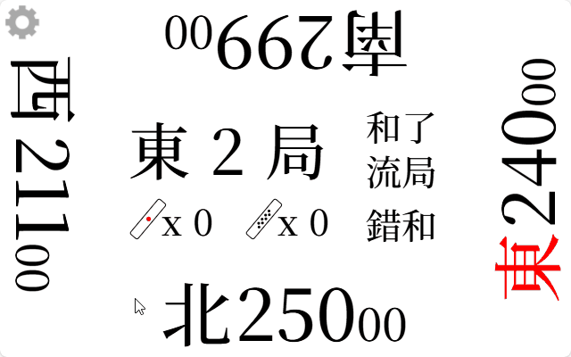
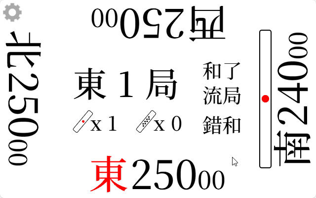
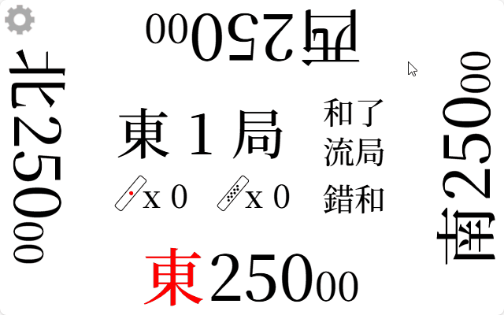
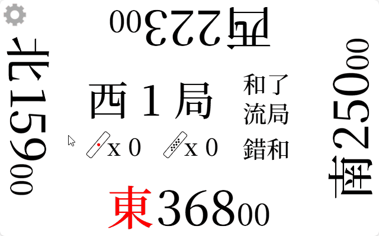
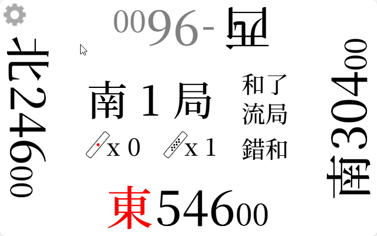

# riichi-mahjong

> [!NOTE]
> **スコア表示ができない卓でリーチ麻雀を楽しむ際に使うための点数カウンターです。**

## Page Link

### [he1fire.github.io/riichi-mahjong](https://he1fire.github.io/riichi-mahjong/ja)

## How To Use

> [!TIP]
> **ページの空きスペースをダブルクリックすると、全画面表示に切り替わります。**

|席選択|
|:---:|
||
|ページにアクセスすると、着席用の東・南・西・北の牌が表示されます。|

|さいころ|
|:---:|
||
|現在の局をクリックすると自動でさいころが振られます。 さいころの合計値と四方の矢印で壁を割る人を確認できます。|

|リーチ|
|:---:|
||
|リーチ宣言時、自分の点数部分を押すとリーチ棒を支払います。|

|点差表示|
|:---:|
||
|自分の風部分を押すと、他プレイヤーとの点差や現在順位を確認できます。|

|和了|
|:---:|
||
|和了ボタンを押し、符・飜を入力すると点数が自動計算されます。|

|役満・包則|
|:---:|
||
|役満の場合は包則ボタンを使って点数を分担して支払えます。|

|ゲーム結果|
|:---:|
||
|ゲーム結果画面で各プレイヤーの点数・ポイント、リーチ、和了、放銃回数を確認できます。 もう一度クリックするとそのゲームの点数推移をグラフで確認できます。|

|点数記録|
|:---:|
||
|点数記録で現在までの進行状況を確認できます。 コピーをクリックすると現在までの進行状況をクリップボードにコピーします。|

|ロールバック|
|:---:|
||
|点数記録の局・本場部分をタッチすると、その時点までロールバックできます。|

|設定|
|:---:|
||
|設定でさまざまなオプションを変更できます。 開始点数を変更すると、その点数で東1局から再スタートします。|
