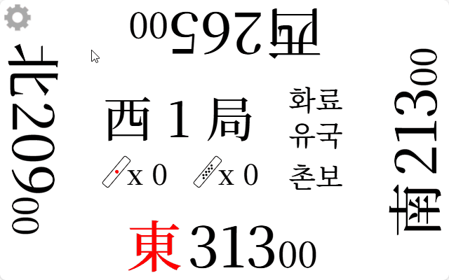

# riichi-mahjong

> [!NOTE]
> **점수 표시가 안되는 탁자에서 리치마작을 즐길때 사용하기 위한 점수 카운터 입니다.**

## Page Link

### [he1fire.github.io/riichi-mahjong](https://he1fire.github.io/riichi-mahjong)

## How To Use

> [!TIP]
> **페이지의 빈 공간을 더블클릭시 전체 화면으로 전환됩니다.**

|자리 선택|
|:---:|
||
|페이지 접속 시 착석을 위한 동, 남, 서, 북 패가 나옵니다.|

|주사위|
|:---:|
||
|현재 국을 클릭 시 자동으로 주사위를 굴립니다. 주사위 합 사방의 화살표로 패산을 떼는 사람을 알 수 있습니다.|

|리치 선언|
|:---:|
||
|리치 선언 시 본인의 점수 부분을 누르면 리치봉을 지불합니다.|

|점수 차 표시|
|:---:|
||
|본인의 바람 부분을 누르면 타가와의 점수 차이 및 현재 순위를 알 수 있습니다.|

|화료|
|:---:|
||
|화료 버튼을 누르고 부,판을 입력하면 점수를 자동으로 계산해 줍니다.|

|역만 / 책임지불|
|:---:|
||
|역만의 경우 책임지불 버튼을 활용해 점수를 나눠 지불할 수 있습니다.|

|게임결과|
|:---:|
||
|게임결과에서 각 사람의 점수/포인트, 리치, 화료, 방총 횟수를 확인할 수 있습니다. 한 번 더 클릭하면 해당 게임의 점수 변화를 그래프로 확인할 수 있습니다.|

|점수 기록|
|:---:|
||
|점수 기록에서 현재까지의 진행 상황을 확인할 수 있습니다. 복사를 클릭하면 현재까지의 진행 상황을 클립보드로 복사합니다.|

|롤백|
|:---:|
||
|점수 기록에서 국/본장 부분을 터치하면 해당 시점으로 롤백할 수 있습니다.|

|설정|
|:---:|
||
|설정에서 여러 가지 옵션들을 수정할 수 있습니다. 시작 점수를 수정할 시 해당 점수를 가지고 동1국부터 다시 시작합니다.|

---

### 마작 룰
- 수정 가능 항목
    - 시작 점수 : **25000점** / -점
    - 반환 점수 : **30000점** / -점
    - 오카 : **20000점** / -점
    - 우마 : **30 10 -10 -30** / - - - -
    - 절상만관 : **없음** / 있음
    - 음수 점수 리치 : **없음** / 있음
    - 오라스 종료시 공탁금 : **1위가 가짐** / 그대로 둠
    - 촌보 벌점 : **3000 All** / 2000-4000
- 수정 불가능 항목
    - 동점시 순위 : **동률로 처리** / 기가에 가까운 순서
    - 노텐 벌부 : **합 3000점** / 없음
    - 연장봉 : **본장당 300점** / 없음
    - 역만 책임지불 시 연장봉 지불 : **쯔모일때는 책임지불자, 론일때는 방총자** / 경우에 따라 다름
    - 쿠이핑후 : **30부로 올림** / 20부로 계산
- 자율 적용 항목
    - 적도라 : **3장 (5만, 5통, 5삭)** / 없음
    - 더블론 : **있음** / 선하네
    - 트리플론 : **있음** / 선하네 / 유국
    - 들통(토비) : **0점 미만** / 0점 이하 / 없음
    - 서입 : **서장까지만** / 무제한 / 없음
    - 아가리야메 : **있음** / 없음
    - 텐파이야메 : **있음** / 없음
    - 쿠이카에 : **없음** / 있음
    - 쯔모차례 없는 리치 : **없음** / 있음
    - 도중유국 : **있음 (사풍연타, 사깡유국, 사가리치, 구종구패)** / 없음
    - 책임지불 : **있음 (대삼원, 대사희)** / 없음
    - 연풍패 머리 : **4부** / 2부
    - 일발 : **있음** / 없음
    - 우라도라 : **있음** / 없음
    - 깡도라/깡우라 : **있음** / 없음
    - 리치 후 안깡 : **있음 (멘쯔 구성이 변하지 않을 때)** / 없음
    - 헤아림 역만 : **있음** / 없음
    - 역만의 중첩 : **있음** / 없음
    - 유국만관 : **화료로 인정** / 축의금으로 처리 / 없음
    - 천/지화 : **있음** / 없음
    - 인화 : **없음** / 있음
    - 국사무쌍 안깡 창깡 : **있음** / 없음
    - 특수대기 역만 더블역만 인정 : **있음** / 없음

### To do
- [x] 컴포넌트 배치
- [x] 자동 화면 회전
- [x] 리치 구현
- [x] 유국 구현
    - [x] 일반유국 구현
    - [x] 도중유국 구현
- [x] 화료 구현
    - [x] 론 구현
    - [x] 쯔모 구현
    - [x] 다가화 구현
    - [x] 책임지불 구현
        - [x] 책임지불 통합/분리 구현
- [x] 촌보 벌금 구현
- [x] 주사위 구현
- [x] 게임시작 자리정하기 구현
- [x] 전체 화면 구현
- [x] 옵션 구현
    - [x] 게임 종료 점수창(이름 점수 우마+오카, 리치및 화료 방총수)
        - [x] 이름
        - [x] 점수 (포인트)
        - [x] 리치, 화료, 방총수
    - [x] 점수 기록
        - [x] 점수 기록 복사
        - [x] 기록으로 롤백
        - [ ] 로그 저장후 이어하기
    - [x] 설정
        - [x] 이름 수정
        - [x] 시작 점수 및 반환 점수 수정
        - [x] 우마, 오카 설정
        - [x] 절상만관
        - [x] 음수리치
        - [x] 마지막 공탁금 처리
        - [x] 촌보 점수 처리
- [x] 점수 차 비교 구현
    - [x] 현재 순위 표시 구현
- [ ] 점수 이동시 이펙트
- [ ] firebase(supabase)이용해서 방 생성 및 실시간 데이터 연결
