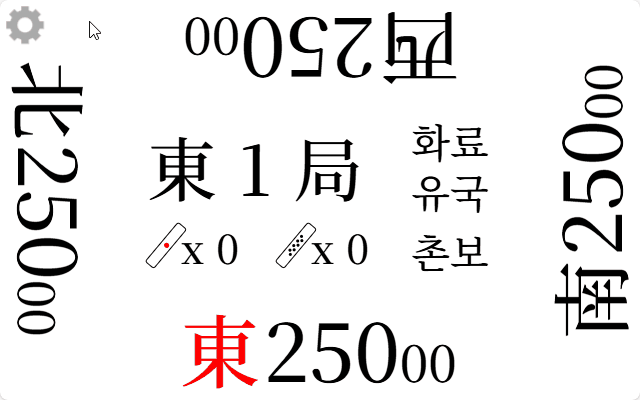

# riichi-mahjong

> [!NOTE]
> **점수 표시가 안되는 탁자에서 리치마작을 즐길때 사용하기 위한 점수 카운터 입니다.**
> 
> **It is a score counter created for use when playing riichi mahjong on tables without score displays.**
> 
> **スコア表示ができない卓でリーチ麻雀を楽しむ際に使うための点数カウンターです。**

## Page Link

### [he1fire.github.io/riichi-mahjong](https://he1fire.github.io/riichi-mahjong)

## How To Use

  

|언어 변경 / change language / 言語変更|
|:---:|
||
|옵션 버튼에서 언어를 바꿀 수 있습니다. You can change the language in the settings. セッティングで言語を変えることができます。|

## Please Share Your Opinion

Feel free to send your opinions, translation suggestions, or feature requests to cmg3172@naver.com or [open a new issue here.](https://github.com/he1fire/riichi-mahjong/issues/new)